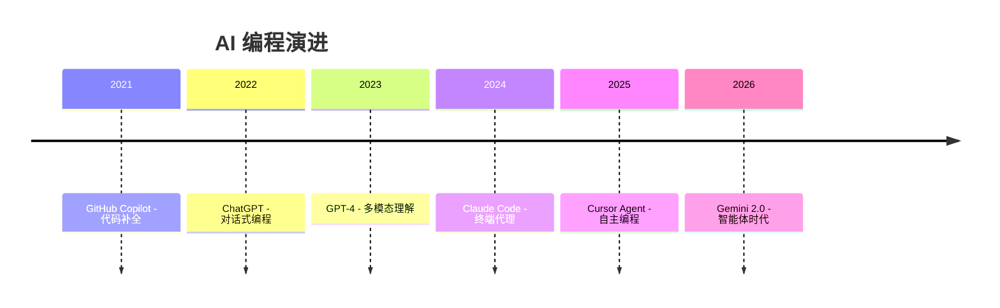
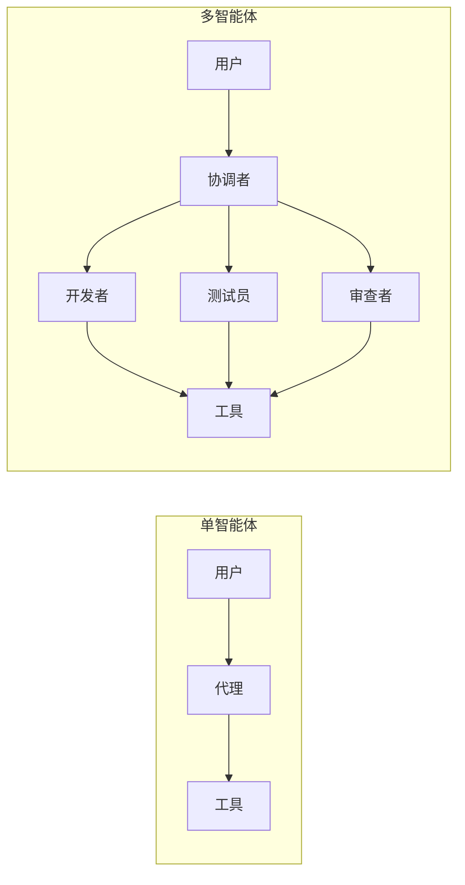

# 智能体编程 (Agentic Coding)

!!! info "AI 2.0 时代"
    2026 年 1 月，Google Gemini 2.0 的发布标志着"智能体时代"的到来。AI 不再只是被动响应，而是能够主动规划和执行复杂任务。

## 🎯 什么是智能体编程？

**智能体编程 (Agentic Coding)** 是指 AI 代理具有自主规划和多步执行能力（持续 5-15+ 步），从被动助手进化为能够分解复杂任务的主动代理。

### 关键特征

| 特征 | 描述 |
|------|------|
| **自主规划** | 能够将复杂任务分解为多个步骤 |
| **多步执行** | 持续执行 5-15+ 步而不中断 |
| **工具使用** | 能够调用各种工具完成任务 |
| **自我纠正** | 能够检测错误并自动修正 |
| **记忆管理** | 能够记住上下文和之前的操作 |

### 演进历程



## 🏗️ 核心架构

### Chain-of-Thought (CoT)

**思维链** 将问题分解为推理步骤，数学性能提升 300%。

```
问题: 23 * 47 = ?

思考步骤:
1. 分解: 23 * 47 = 23 * (40 + 7)
2. 计算: 23 * 40 = 920
3. 计算: 23 * 7 = 161
4. 求和: 920 + 161 = 1081

答案: 1081
```

### CoT 变体

| 变体 | 描述 | 用例 |
|------|------|------|
| **Zero-Shot CoT** | 无示例直接推理 | 通用问题 |
| **Few-Shot CoT** | 使用示例引导 | 复杂推理 |
| **Tree-of-Thought** | 探索多个推理路径 | 决策问题 |
| **Self-Consistency** | 多次采样取共识 | 高可靠性任务 |

### ReAct 模式

**ReAct** 交替进行推理和行动（Thought → Action → Observation）。

```
Thought: 用户需要实现用户认证功能
Action: 搜索项目中的认证相关代码
Observation: 找到 src/auth/ 目录，有基础的登录逻辑

Thought: 需要添加 JWT 支持
Action: 创建 src/auth/jwt.ts 文件
Observation: 文件创建成功

Thought: 实现 JWT 生成和验证
Action: 编写 JWT 相关函数
...
```

## 🤖 多智能体架构

### 类型



| 架构 | 描述 | 用例 |
|------|------|------|
| **单智能体** | 一个代理处理所有任务 | 简单任务 |
| **层级式** | 主管代理分配任务给子代理 | 复杂项目 |
| **团队式** | 角色分工的代理协作 | 企业开发 |
| **Swarm** | 大量简单代理协同 | 大规模任务 |

### 角色分工示例

| 角色 | 职责 |
|------|------|
| **开发者** | 编写代码 |
| **测试员** | 编写和运行测试 |
| **审查者** | 代码审查 |
| **文档员** | 编写文档 |
| **部署者** | CI/CD 操作 |

## 🛠️ 支持智能体编程的工具

### IDE 类

| 工具 | 特点 | 价格 |
|------|------|------|
| **Cursor** | 原生 AI IDE，Agent 模式 | $20-200/月 |
| **Claude Code** | 终端代理，MCP 支持 | $20-200/月 |
| **Windsurf** | 首个"智能体 IDE" | $0-15/月 |
| **Trae** | 字节跳动，完全免费 | 免费 |
| **VS Code + Cline** | 开源，浏览器+终端代理 | 免费 |

### 框架类

| 框架 | 语言 | 特点 |
|------|------|------|
| **CrewAI** | Python | 业务工作流，角色扮演 |
| **AutoGen** | Python | 微软研究，多代理对话 |
| **LangGraph** | Python | 状态机，可控流程 |
| **PraisonAI** | Python | 生产级，低代码 |
| **LangChain** | Python/JS | 通用 LLM 框架 |

## 📖 框架示例

### CrewAI 示例

```python title="crew_example.py"
from crewai import Agent, Task, Crew

# 定义代理
developer = Agent(
    role="高级开发者",
    goal="编写高质量代码",
    backstory="你是一位经验丰富的全栈开发者",
    allow_delegation=False
)

reviewer = Agent(
    role="代码审查者",
    goal="确保代码质量",
    backstory="你是代码质量专家",
    allow_delegation=True
)

# 定义任务
coding_task = Task(
    description="实现用户登录功能",
    agent=developer,
    expected_output="可工作的登录代码"
)

review_task = Task(
    description="审查登录代码",
    agent=reviewer,
    expected_output="代码审查报告"
)

# 创建团队
crew = Crew(
    agents=[developer, reviewer],
    tasks=[coding_task, review_task]
)

# 执行
result = crew.kickoff()
```

### LangGraph 示例

```python title="langgraph_example.py"
from langgraph.graph import StateGraph, END
from typing import TypedDict

class State(TypedDict):
    messages: list
    next_action: str

def planner(state: State) -> State:
    # 规划下一步
    return {"next_action": "code"}

def coder(state: State) -> State:
    # 编写代码
    return {"next_action": "test"}

def tester(state: State) -> State:
    # 运行测试
    return {"next_action": "end"}

# 构建图
graph = StateGraph(State)
graph.add_node("planner", planner)
graph.add_node("coder", coder)
graph.add_node("tester", tester)

graph.add_edge("planner", "coder")
graph.add_edge("coder", "tester")
graph.add_edge("tester", END)

graph.set_entry_point("planner")
app = graph.compile()
```

## 💡 最佳实践

### 1. 沙箱执行

!!! warning "安全第一"
    始终在沙箱环境中执行代理生成的代码。

```python
# 使用 Docker 沙箱
import docker

client = docker.from_env()
container = client.containers.run(
    "python:3.11",
    command="python script.py",
    volumes={'/host/code': {'bind': '/code', 'mode': 'ro'}},
    remove=True
)
```

### 2. 结构化提示词

```markdown
# 任务: 实现用户认证

## 约束
- 使用 JWT 认证
- 密码使用 bcrypt 加密
- 支持 refresh token

## 输出格式
- 代码文件
- 测试文件
- 使用说明

## 禁止
- 硬编码密钥
- 明文存储密码
- 跳过输入验证
```

### 3. 人机协作

```python
# 关键决策需要人工确认
CRITICAL_ACTIONS = [
    "删除文件",
    "修改数据库",
    "部署到生产",
    "发送邮件"
]

def execute_with_confirmation(action: str, code: str):
    if action in CRITICAL_ACTIONS:
        user_input = input(f"确认执行 {action}? (y/n): ")
        if user_input.lower() != 'y':
            return "操作取消"
    return execute(code)
```

### 4. Token 监控

```python
import tiktoken

def count_tokens(text: str, model: str = "gpt-4") -> int:
    encoding = tiktoken.encoding_for_model(model)
    return len(encoding.encode(text))

# 设置预算
MAX_TOKENS_PER_TASK = 50000

if current_tokens > MAX_TOKENS_PER_TASK:
    raise TokenBudgetExceeded("Token 预算超限")
```

## 📚 学习资源

### 综合资源

| 资源 | 描述 |
|------|------|
| [Awesome AI Agents](https://github.com/slavakurilyak/awesome-ai-agents) | 300+ 资源汇总 |
| [AI Agents Frameworks](https://github.com/martimfasantos/ai-agents-frameworks) | 框架对比 |

### 框架文档

| 框架 | 文档 |
|------|------|
| CrewAI | [docs.crewai.com](https://docs.crewai.com) |
| LangChain | [python.langchain.com](https://python.langchain.com) |
| LangGraph | [langchain-ai.github.io/langgraph](https://langchain-ai.github.io/langgraph) |
| AutoGen | [microsoft.github.io/autogen](https://microsoft.github.io/autogen) |

### 学习路径

```
Week 1: 理解概念 → CoT、ReAct 原理
Week 2: 单智能体 → 使用 Claude Code/Cursor
Week 3: 框架入门 → CrewAI/LangGraph
Week 4: 多智能体 → 构建代理团队
```

## 🎯 使用场景

### 1. 代码生成与重构

```
用户: "重构这个模块，使其更易于测试"
代理: 分析代码 → 识别依赖 → 设计接口 → 重构 → 生成测试
```

### 2. 自动化测试

```
用户: "为 API 端点生成测试"
代理: 分析 API → 生成测试用例 → 编写测试 → 运行验证
```

### 3. 文档生成

```
用户: "为这个项目生成文档"
代理: 分析代码结构 → 提取注释 → 生成 API 文档 → 创建 README
```

### 4. Bug 修复

```
用户: "修复这个 bug"
代理: 分析错误日志 → 定位问题 → 提出修复方案 → 实施修复 → 验证
```

---

## 下一步

- 🤖 [深入了解架构模式](./architectures.md)
- 🔧 [学习工作流设计](./workflows.md)
- 📖 [阅读最佳实践](./best-practices.md)
