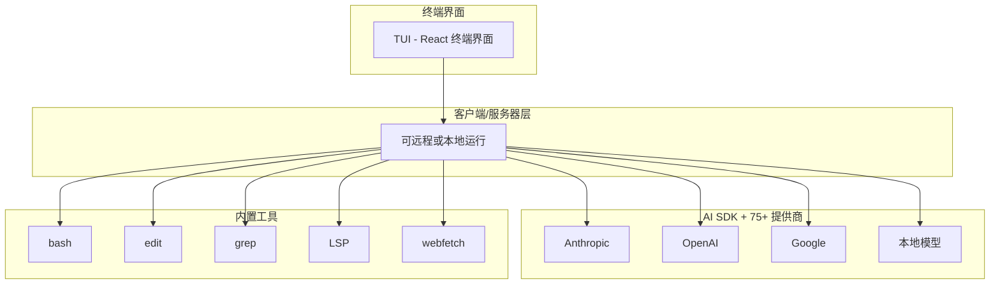

# OpenCode 开源 AI 编程代理

!!! success "100% 开源"
    OpenCode 是一个完全开源的 AI 编程代理，支持 75+ LLM 提供商，由 SST 团队开发。

## 🎯 什么是 OpenCode？

**OpenCode** 是一个为终端构建的开源 AI 编程代理，类似于 Claude Code 但有关键区别：

| 特性 | OpenCode | Claude Code |
|------|----------|-------------|
| **许可证** | ✅ 100% 开源 | ❌ 专有 |
| **提供商锁定** | ✅ 提供商无关（75+）| ❌ 仅 Anthropic |
| **终端 UI** | ✅ 高级 TUI（React）| 基础 TUI |
| **客户端/服务器** | ✅ 是（远程控制）| ❌ 否 |
| **自定义命令** | ✅ 是（markdown 文件）| 有限 |
| **分享对话** | ✅ 是（链接）| ❌ 否 |

## 🚀 安装

=== "一键安装"
    ```bash
    curl -fsSL https://opencode.ai/install | bash
    ```

=== "npm"
    ```bash
    npm install -g opencode-ai@latest
    ```

=== "Homebrew (macOS)"
    ```bash
    brew install anomalyco/tap/opencode
    ```

=== "Arch Linux"
    ```bash
    paru -S opencode-bin
    ```

=== "Windows (Chocolatey)"
    ```powershell
    choco install opencode
    ```

=== "Windows (Scoop)"
    ```powershell
    scoop install opencode
    ```

## 🏗️ 架构



## ⚡ 快速开始

### 1. 配置提供商

```bash
opencode
/connect  # 选择提供商并添加 API 密钥
```

### 2. 初始化项目

```bash
cd /path/to/project
opencode
/init     # 创建 AGENTS.md
```

### 3. 基本使用

```bash
# 切换 Plan/Build 模式
<TAB>  # 切换模式

# 提问
"How is authentication handled in @packages/functions/src/api/index.ts"

# 添加功能（Plan 模式）
"When a user deletes a note, flag it as deleted in the database.
Then create a screen that shows all recently deleted notes."

# 构建功能（切换到 Build 模式）
"Sounds good! Go ahead and make the changes."

# 撤销更改
/undo

# 分享对话
/share
```

## ⚙️ 配置

### opencode.json

```json title="opencode.json"
{
  "$schema": "https://opencode.ai/config.json",
  "theme": "opencode",
  "model": "anthropic/claude-sonnet-4-5",
  "autoupdate": true,
  "provider": {
    "anthropic": {
      "options": {
        "baseURL": "https://api.anthropic.com/v1"
      }
    }
  },
  "tui": {
    "scroll_speed": 3,
    "diff_style": "auto"
  },
  "mcp": {
    "jira": {
      "type": "remote",
      "url": "https://jira.example.com/mcp",
      "enabled": true
    }
  }
}
```

### 自定义命令

创建 `.opencode/commands/test.md`：

```markdown
---
description: Run tests with coverage
agent: build
model: anthropic/claude-3-5-sonnet-20241022
---

Run the full test suite with coverage report and show any failures.
Focus on the failing tests and suggest fixes.
```

使用：`/test`

## 🛠️ 内置工具

| 工具 | 用途 |
|------|------|
| `bash` | 执行 shell 命令 |
| `edit` | 用提示词编辑文件 |
| `read` | 读取文件内容 |
| `write` | 写入/创建文件 |
| `grep` | 搜索文件内容 |
| `glob` | 按模式查找文件 |
| `patch` | 应用补丁 |
| `lsp-diagnostics` | 获取 LSP 错误/警告 |
| `lsp-hover` | 从 LSP 获取类型信息 |
| `webfetch` | 获取 URL 内容 |
| `websearch` | Web 搜索 |
| `task` | 后台任务 |
| `todo` | 任务管理 |

## 🔌 支持的 LLM 提供商

### 主要提供商

| 提供商 | 模型 |
|--------|------|
| **Anthropic** | Claude 3.5 Sonnet, Claude 3 Opus |
| **OpenAI** | GPT-4, GPT-4o, GPT-3.5 |
| **Google** | Gemini Pro, Gemini Ultra |
| **Amazon** | Bedrock |

### 本地模型

| 工具 | 描述 |
|------|------|
| **Ollama** | 本地运行开源模型 |
| **LM Studio** | 桌面端本地模型 |

### 其他提供商

- 302.AI
- Groq
- Together AI
- Azure OpenAI
- 等等...

## 📖 AGENTS.md

OpenCode 使用 `AGENTS.md` 文件了解项目上下文：

```markdown title="AGENTS.md"
# My Project Knowledge Base

**Generated:** 2026-02-12
**Commit:** abc123
**Branch:** main

## OVERVIEW

Brief description of the project and its purpose.

## STRUCTURE

```
./
├── src/           # Source code
├── tests/         # Test files
├── docs/          # Documentation
└── config/        # Configuration
```

## WHERE TO LOOK

| Task | Location |
|------|----------|
| API endpoints | `src/api/` |
| Database models | `src/models/` |
| Tests | `tests/` |

## CONVENTIONS

- Use TypeScript for all new files
- Follow ESLint rules
- Write tests for new features

## COMMANDS

```bash
npm run dev      # Start development server
npm run test     # Run tests
npm run build    # Build for production
```
```

## 🔗 学习资源

### 官方资源

| 资源 | 链接 |
|------|------|
| **GitHub** | [github.com/sst/opencode](https://github.com/sst/opencode) |
| **文档** | [opencode.ai/docs](https://opencode.ai/docs) |
| **配置 Schema** | [opencode.ai/config.json](https://opencode.ai/config.json) |

### 社区

| 资源 | 链接 |
|------|------|
| **YouTube** | [youtube.com/c/sst-dev](https://youtube.com/c/sst-dev) |
| **X/Twitter** | [@SST_dev](https://x.com/SST_dev) |

---

## 下一步

- 🚀 [安装 OpenCode](#安装)
- 📖 [阅读官方文档](https://opencode.ai/docs)
- 🎬 [观看 YouTube 教程](https://youtube.com/c/sst-dev)
