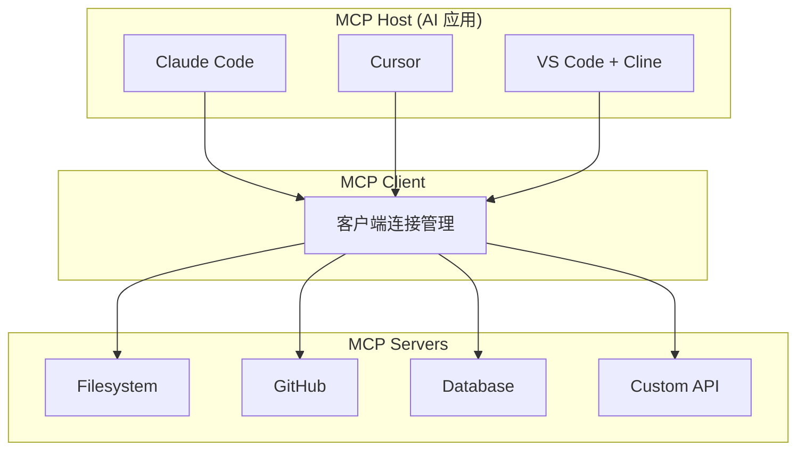

# MCP (Model Context Protocol) 完全指南

!!! success "开放标准"
    MCP 是由 Anthropic 于 2024 年 11 月发布的开放标准，旨在解决 AI 模型与数据源之间的连接问题。

## 🎯 什么是 MCP？

**Model Context Protocol (MCP)** 是一个开放标准，它使开发者能够在数据源和 AI 工具之间建立安全、双向的连接。

### 核心问题

AI 模型面临的最大挑战之一是**数据隔离**——它们被困在信息孤岛和遗留系统后面。MCP 提供了一个通用的开放标准，用单一协议替代碎片化的集成方案。

### 核心能力

MCP 服务器可以提供三种主要类型的能力：

| 能力 | 描述 | 示例 |
|------|------|------|
| **Resources** | 客户端可读取的类文件数据 | API 响应、文件内容 |
| **Tools** | LLM 可调用的函数（需用户批准） | 执行命令、查询数据库 |
| **Prompts** | 帮助用户完成特定任务的预写模板 | 代码审查模板、文档生成 |

## 🏗️ 架构概览



### 关键参与者

1. **MCP Host**: 协调和管理 MCP 客户端的 AI 应用（如 Claude Code、Cursor）
2. **MCP Client**: 维护与 MCP 服务器连接的组件
3. **MCP Server**: 向 MCP 客户端提供上下文的程序

## 🚀 快速开始

### 安装 Python SDK

```bash
pip install "mcp[cli]" httpx
```

### 创建你的第一个 MCP 服务器

```python title="weather_server.py"
from typing import Any
import httpx
from mcp.server.fastmcp import FastMCP

mcp = FastMCP("weather")

NWS_API_BASE = "https://api.weather.gov"
USER_AGENT = "weather-app/1.0"

async def make_nws_request(url: str) -> dict[str, Any] | None:
    headers = {
        "User-Agent": USER_AGENT,
        "Accept": "application/geo+json"
    }
    async with httpx.AsyncClient() as client:
        try:
            response = await client.get(url, headers=headers, timeout=30.0)
            response.raise_for_status()
            return response.json()
        except Exception:
            return None

@mcp.tool()
async def get_alerts(state: str) -> str:
    """获取美国州的天气警报。
    
    Args:
        state: 两字母美国州代码（如 CA, NY）
    """
    url = f"{NWS_API_BASE}/alerts/active/area/{state}"
    data = await make_nws_request(url)
    
    if not data or "features" not in data:
        return "无法获取警报或未找到警报。"
    
    if not data["features"]:
        return "该州没有活跃警报。"
    
    alerts = [format_alert(feature) for feature in data["features"]]
    return "\n---\n".join(alerts)

@mcp.tool()
async def get_forecast(latitude: float, longitude: float) -> str:
    """获取指定位置的天气预报。
    
    Args:
        latitude: 纬度
        longitude: 经度
    """
    points_url = f"{NWS_API_BASE}/points/{latitude},{longitude}"
    points_data = await make_nws_request(points_url)
    
    if not points_data:
        return "无法获取该位置的预报数据。"
    
    forecast_url = points_data["properties"]["forecast"]
    forecast_data = await make_nws_request(forecast_url)
    
    if not forecast_data:
        return "无法获取详细预报。"
    
    periods = forecast_data["properties"]["periods"]
    forecasts = []
    for period in periods[:5]:
        forecast = f"""
{period['name']}:
温度: {period['temperature']}°{period['temperatureUnit']}
风: {period['windSpeed']} {period['windDirection']}
预报: {period['detailedForecast']}
"""
        forecasts.append(forecast)
    
    return "\n".join(forecasts)

if __name__ == "__main__":
    mcp.run(transport="stdio")
```

### 配置 Claude Desktop

编辑配置文件：

- **macOS**: `~/Library/Application Support/Claude/claude_desktop_config.json`
- **Windows**: `%AppData%\Claude\claude_desktop_config.json`

```json
{
  "mcpServers": {
    "weather": {
      "command": "uv",
      "args": [
        "--directory",
        "/path/to/weather-server",
        "run",
        "weather_server.py"
      ]
    },
    "filesystem": {
      "command": "npx",
      "args": [
        "-y",
        "@modelcontextprotocol/server-filesystem",
        "/path/to/allowed/files"
      ]
    },
    "github": {
      "command": "npx",
      "args": ["-y", "@modelcontextprotocol/server-github"],
      "env": {
        "GITHUB_PERSONAL_ACCESS_TOKEN": "<YOUR_TOKEN>"
      }
    }
  }
}
```

## 📦 官方 SDK

| 语言 | 仓库 | 状态 |
|------|------|------|
| **Python** | [python-sdk](https://github.com/modelcontextprotocol/python-sdk) | ✅ 生产就绪 |
| **TypeScript** | [typescript-sdk](https://github.com/modelcontextprotocol/typescript-sdk) | ✅ 生产就绪 |
| **Java** | [java-sdk](https://github.com/modelcontextprotocol/java-sdk) | ✅ 生产就绪 |
| **Go** | [go-sdk](https://github.com/modelcontextprotocol/go-sdk) | ✅ 生产就绪 |
| **C#** | [csharp-sdk](https://github.com/modelcontextprotocol/csharp-sdk) | ✅ 生产就绪 |
| **Kotlin** | [kotlin-sdk](https://github.com/modelcontextprotocol/kotlin-sdk) | ✅ 生产就绪 |
| **Rust** | [rust-sdk](https://github.com/modelcontextprotocol/rust-sdk) | ✅ 生产就绪 |
| **Swift** | [swift-sdk](https://github.com/modelcontextprotocol/swift-sdk) | ✅ 生产就绪 |
| **Ruby** | [ruby-sdk](https://github.com/modelcontextprotocol/ruby-sdk) | ✅ 生产就绪 |
| **PHP** | [php-sdk](https://github.com/modelcontextprotocol/php-sdk) | ✅ 生产就绪 |

## 🛠️ 热门 MCP 服务器

### 官方服务器

| 服务器 | 描述 | 命令 |
|--------|------|------|
| **Filesystem** | 安全的文件操作 | `npx -y @modelcontextprotocol/server-filesystem /path` |
| **GitHub** | GitHub API 集成 | `npx -y @modelcontextprotocol/server-github` |
| **Git** | Git 仓库操作 | `npx -y @modelcontextprotocol/server-git` |
| **Memory** | 知识图谱持久化 | `npx -y @modelcontextprotocol/server-memory` |
| **Fetch** | Web 内容获取 | `npx -y @modelcontextprotocol/server-fetch` |

### 数据库集成

| 服务器 | 描述 |
|--------|------|
| [MongoDB](https://github.com/mongodb-js/mongodb-mcp-server) | MongoDB Atlas 和数据库 |
| [Neo4j](https://github.com/neo4j-contrib/mcp-neo4j) | Neo4j 图数据库 |
| [Qdrant](https://github.com/qdrant/mcp-server-qdrant) | Qdrant 向量数据库 |
| [PostgreSQL](https://github.com/crystaldba/postgres-mcp) | PostgreSQL 数据库 |
| [MySQL](https://github.com/designcomputer/mysql_mcp_server) | MySQL 数据库 |

### 开发工具

| 服务器 | 描述 |
|--------|------|
| [Playwright](https://github.com/executeautomation/mcp-playwright) | 浏览器自动化 |
| [Kubernetes](https://github.com/rohitg00/kubectl-mcp-server) | K8s 操作 |
| [Elasticsearch](https://github.com/cr7258/elasticsearch-mcp-server) | ES 搜索 |

## 📖 TypeScript 示例

```typescript title="fetch-server.ts"
import { McpServer } from "@modelcontextprotocol/sdk/server/mcp.js";
import { StdioServerTransport } from "@modelcontextprotocol/sdk/server/stdio.js";
import { z } from "zod";

const server = new McpServer({
  name: "fetch-server",
  version: "1.0.0",
});

server.tool(
  "fetch_url",
  "获取 URL 内容并返回",
  {
    url: z.string().url().describe("要获取的 URL"),
  },
  async ({ url }) => {
    const response = await fetch(url);
    const text = await response.text();
    
    return {
      content: [
        {
          type: "text",
          text: text.slice(0, 10000),
        },
      ],
    };
  }
);

async function main() {
  const transport = new StdioServerTransport();
  await server.connect(transport);
  console.error("Fetch MCP Server running on stdio");
}

main().catch(console.error);
```

## 🔒 最佳实践

### 1. STDIO 服务器的日志记录

!!! warning "重要"
    对于 STDIO 服务器，**永远不要写入 stdout**，否则会破坏 JSON-RPC 消息。

```python
import sys
import logging

logging.basicConfig(
    level=logging.INFO,
    stream=sys.stderr,
    format='%(asctime)s - %(name)s - %(levelname)s - %(message)s'
)

logger = logging.getLogger(__name__)
logger.info("Server started")
```

### 2. 安全性

- 使用 `.env` 文件安全存储 API 密钥
- 在处理前验证服务器响应
- 实现适当的访问控制
- 在配置中使用绝对路径

### 3. 错误处理

```python
@mcp.tool()
async def safe_operation(data: str) -> str:
    try:
        result = await process_data(data)
        return result
    except ValueError as e:
        return f"输入错误: {str(e)}"
    except Exception as e:
        logger.error(f"操作失败: {e}")
        return f"操作失败，请稍后重试"
```

### 4. 传输选择

| 场景 | 推荐传输 |
|------|----------|
| 本地 CLI 工具 | STDIO |
| Web API | Streamable HTTP |
| 实时更新 | Streamable HTTP + SSE |
| 多租户 SaaS | Streamable HTTP + OAuth |

## 🔗 学习资源

### 官方资源

- 📚 [官方文档](https://modelcontextprotocol.io)
- 📋 [协议规范](https://spec.modelcontextprotocol.io)
- 🗂️ [MCP 服务器仓库](https://github.com/modelcontextprotocol/servers)
- 🔍 [MCP Inspector](https://github.com/modelcontextprotocol/inspector)

### 社区资源

- ⭐ [Awesome MCP](https://github.com/punkpeye/awesome-mcp-devtools)
- 📦 [MCP 服务器目录](https://github.com/cursor/mcp-servers)

### 教程

| 资源 | 类型 | 链接 |
|------|------|------|
| 构建服务器教程 | 官方文档 | [链接](https://modelcontextprotocol.io/docs/develop/build-server) |
| Python SDK 快速开始 | GitHub | [链接](https://github.com/modelcontextprotocol/python-sdk) |
| TypeScript SDK 文档 | GitHub | [链接](https://github.com/modelcontextprotocol/typescript-sdk) |

## 🎯 使用场景

### 1. 代码助手扩展

```
用户 → Claude Code → MCP Client → GitHub MCP Server → 获取 PR 信息
```

### 2. 数据库查询

```
用户 → Cursor → MCP Client → PostgreSQL MCP Server → 执行 SQL
```

### 3. 文档处理

```
用户 → Claude Desktop → MCP Client → Filesystem MCP Server → 读写文件
```

## 📊 工具集成状态

| 工具 | MCP 支持 | 配置方式 |
|------|----------|----------|
| **Claude Code** | ✅ 原生 | `~/.claude/config.json` |
| **Claude Desktop** | ✅ 原生 | `claude_desktop_config.json` |
| **Cursor** | ✅ 原生 | 设置 → Agent |
| **VS Code + Cline** | ✅ 支持 | settings.json |
| **Windsurf** | ✅ 支持 | 设置面板 |
| **OpenCode** | ✅ 支持 | opencode.json |

---

## 下一步

- 🚀 [创建你的第一个 MCP 服务器](./quickstart.md)
- 📖 [深入了解 MCP 概念](./concepts.md)
- 🛠️ [浏览 MCP 工具目录](./tools-reference.md)
